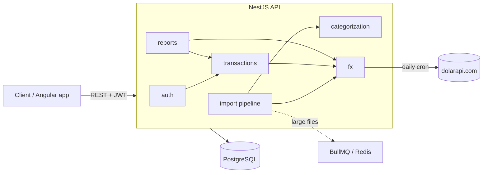

# Finance Tracker (AR) 🇦🇷

A personal finance / budget tracker built backend-first with **NestJS + TypeScript +
PostgreSQL**. Designed around the realities of money in **Argentina**: multi-currency
(ARS/USD) accounting, the multiple USD exchange rates, and the credit-card *"dólar tarjeta"*
percepción mechanic.

> Portfolio project. The headline feature is a **statement-import pipeline** (CSV/XLSX →
> parse → de-duplicate → auto-categorize → FX-valuate → persist) rather than plain CRUD.

## Status

🚧 **Step 1 — scaffolding.** Project boots against an empty Postgres. Entities, FX module,
auth, the import pipeline, and reports follow (see build order below).

## Tech stack

| Concern | Choice |
|---|---|
| Framework | NestJS 11 (TypeScript) |
| Database | PostgreSQL 16 |
| ORM | TypeORM (migrations, no `synchronize`) |
| Money | Integer **cents** in `bigint` columns, never floats |
| Config | `@nestjs/config` + `class-validator` env validation |
| Jobs (later) | BullMQ + Redis, `@nestjs/schedule` for the daily FX sync |

## Architecture (target)



## Getting started

```bash
# 1. Start Postgres (and Redis, for later)
docker compose up -d

# 2. Configure env
cp .env.example .env   # defaults match docker-compose

# 3. Install + run
npm install
npm run start:dev      # http://localhost:3000
```

### Migrations

```bash
npm run migration:generate -- src/database/migrations/<Name>
npm run migration:run
npm run migration:revert
```

## Project structure

```
src/
  common/         value transformers (bigint cents), guards, filters
  config/         env loading + validation
  database/       TypeORM datasource + migrations
  auth/           JWT register/login, @CurrentUser()
  fx/             ExchangeRate, dolarapi sync, valuation, daily cron
  categorization/ shared rules engine
  import/         upload + pipeline; parsers/ (Strategy pattern)
  reports/        read-only aggregations
  users/ accounts/ categories/ transactions/ budgets/ rules/
```

## Build order

1. ✅ Scaffold: Nest + TypeORM + Postgres, bigint cents transformer, docker-compose.
2. ✅ Entities + first migration.
3. ✅ FxModule (dolarapi sync, valuation, daily cron). Seed with `npm run seed:fx`.
4. ✅ AuthModule (JWT register/login, global guard, `@CurrentUser()`).
5. ⬜ Import pipeline (parsers, dedup, categorization, credit-card statements).
6. ⬜ ReportsModule (spend by category, budget vs actual, net worth).
7. ⬜ Deploy + architecture write-up.
